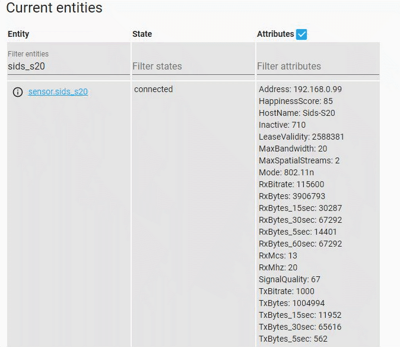

[](https://github.com/custom-components/hacs)

# Hass Amplifi

A sensor hass integration that allows you to monitor devices connected to Amplifi on Wifi (LAN ports in progress).

You can use this addon to perform the following automations:
- As a presense sensor (when your mobile connects to wifi)
- Internet bandwidth usage monitor (amplifi reports data transfers on the WAN port). Coming soon...
- When your TV is on/off (monitoring its wifi traffic)
- Security (Create alerts for unknown devices connected to your wifi)




## Installation

### Install with HACS (recomended)

Do you you have [HACS](https://community.home-assistant.io/t/custom-component-hacs) installed? Once you have HACS.
- Add `puttyman/hass-amplifi` as a custom repository
- Click on th **Install** button for Hass Amplifi

### Install manually

1. Install this platform by creating a `custom_components` folder in the same folder as your configuration.yaml, if it doesn't already exist.
2. Create another folder `amplifi` in the `custom_components` folder. Copy all files from custom_components into the `amplifi` folder.

## Setup

You can setup this component by using HA integration by going to Configuration -> Integration. Then click on the `+` bottom right button. Search for `Amplifi`. Simply enter your hostname and password for your Amplifi router.

### Configure in config.yaml

When you have installed shelly and make sure it exists under `custom_components` folder it is time to configure it in Home Assistant.

It is very easy, just add `shelly:` to your `configuration.yaml`


## Supported devices
- Amplifi HD firmware version 3.4.2

## Caveats
- When logged in the amplifi portal on your browser the current hass session is invalidated. However, the next data refresh should resuming monitoring.


## Development

Enable logging by defining the logger entry to your configuration.yaml.

```
logger:
  default: info
  logs:
    custom_components.amplifi: debug
```
